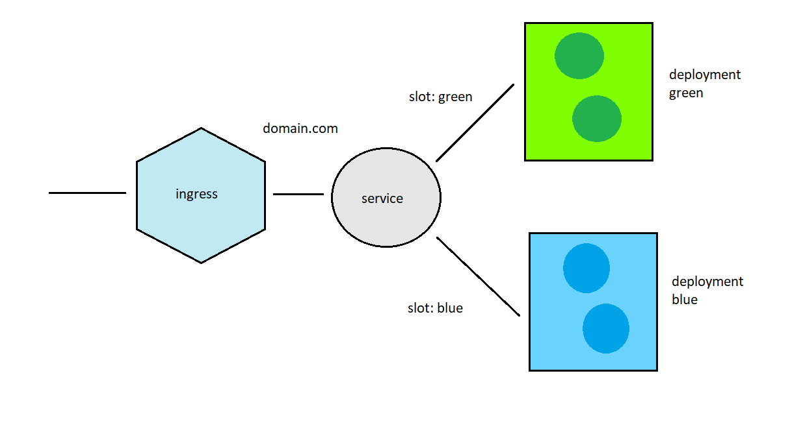
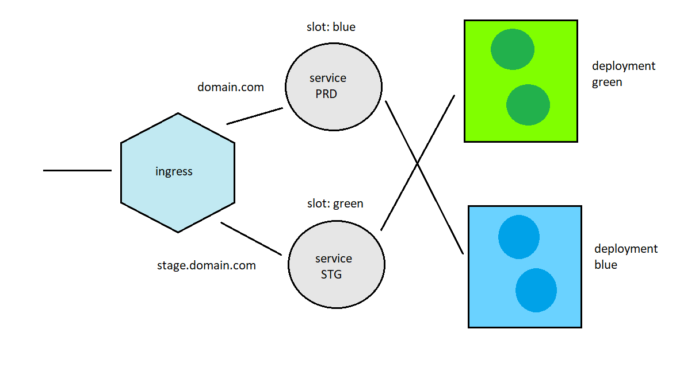

# Blue Green with Helm

This spike is about implementing a **Blue/Green** deployment strategy using helm package manager. To be honest Helm wasn't born thinking about B/G but with some trick we are able to do it. 

This is an implementation related to the article here https://medium.com/@saraswatpuneet/blue-green-deployments-using-helm-charts-93ec479c0282


## What we need...

- docker desktop, minikube or a real K8s cluster
- Helm version 3 or above
- Nginx as ingress 
- A simple service (build using dot net core) 


## Installing NGINX

In the nginx folder you can find two yaml file coming directly from nginx we site. The only difference is about the namespace. We are going to use **default** instead of **ingress-nginx**.

```bash

> kubectl apply -f nginx/mandatory.yaml

> kubectl apply -f nginx/cloud-generic.yaml

```


## my-service

In order to test the blue/green deployment we are going to use a little service developed using dotnet core. This service expose a resource  ```/weatherforecast/slot``` returning a simple string like this

```c#
        [HttpGet("slot")]
        public string Slot()
            => $"{_serviceDescription.Slot} - {_serviceDescription.Version}";

```


## Topology

Looking at the yaml files in the template folder

```
.
├── Chart.yaml
├── deploy.yaml
├── templates
│   ├── blue
│   │   ├── config.yaml
│   │   └── deployment.yaml
│   ├── green
│   │   ├── config.yaml
│   │   └── deployment.yaml
│   ├── prd
│   │   ├── ingress.yaml
│   │   └── service.yaml
│   └── stg
│       ├── ingress.yaml
│       └── service.yaml
└── values.yaml
```

we get the following topology of the system



where the service prd and the service stg use the selector **slot:blue|green** to point the the right deployment.

## Release 0.1.0

deploy.yaml

```yaml
blue:
  version: "0.1.0"

green:
  version: "0.1.0"

productionSlot: green
```

command

```bash
helm upgrade my-service helm/ --debug --install -f helm/deploy.yaml
```

result

```bash
> kubectl get svc
NAME             TYPE           CLUSTER-IP      EXTERNAL-IP   PORT(S)                      AGE
ingress-nginx    LoadBalancer   10.97.201.105   localhost     80:31940/TCP,443:30232/TCP   42h
kubernetes       ClusterIP      10.96.0.1       <none>        443/TCP                      2d3h
my-service-prd   ClusterIP      10.102.1.193    <none>        80/TCP                       38m
my-service-stg   ClusterIP      10.102.94.73    <none>        80/TCP                       38m

> kubectl get configmap
NAME                              DATA   AGE
ingress-controller-leader-nginx   0      42h
my-service-blue                   1      39m
my-service-green                  1      39m
nginx-configuration               0      42h
tcp-services                      0      42h
udp-services                      0      42h

> kubectl get deploy
NAME                       READY   UP-TO-DATE   AVAILABLE   AGE
my-service-blue            1/1     1            1           40m
my-service-green           1/1     1            1           40m
nginx-ingress-controller   1/1     1            1           42h

> kubectl get pods
NAME                                        READY   STATUS    RESTARTS   AGE
my-service-blue-598ffcc8d5-qwbbn            1/1     Running   0          2m37s
my-service-green-7fb46c446d-mx8gs           1/1     Running   0          40m
nginx-ingress-controller-7f74f657bd-gfxcv   1/1     Running   0          42h

❯ curl http://localhost.prd/weatherforecast/slot -v
*   Trying 127.0.0.1...
* TCP_NODELAY set
* Connected to localhost.prd (127.0.0.1) port 80 (#0)
> GET /weatherforecast/slot HTTP/1.1
> Host: localhost.prd
> User-Agent: curl/7.58.0
> Accept: */*
>
< HTTP/1.1 200 OK
< Server: nginx/1.17.8
< Date: Thu, 05 Mar 2020 12:04:25 GMT
< Content-Type: text/plain; charset=utf-8
< Transfer-Encoding: chunked
< Connection: keep-alive
< Vary: Accept-Encoding
< Access-Control-Allow-Origin: *
< Access-Control-Allow-Credentials: true
< Access-Control-Allow-Methods: GET, PUT, POST, DELETE, PATCH, OPTIONS
< Access-Control-Allow-Headers: DNT,X-CustomHeader,Keep-Alive,User-Agent,X-Requested-With,If-Modified-Since,Cache-Control,Content-Type,Authorization
<
* Connection #0 to host localhost.prd left intact
green - 0.1.0#

❯ curl http://localhost.stg/weatherforecast/slot -v
*   Trying 127.0.0.1...
* TCP_NODELAY set
* Connected to localhost.stg (127.0.0.1) port 80 (#0)
> GET /weatherforecast/slot HTTP/1.1
> Host: localhost.stg
> User-Agent: curl/7.58.0
> Accept: */*
>
< HTTP/1.1 200 OK
< Server: nginx/1.17.8
< Date: Thu, 05 Mar 2020 12:05:00 GMT
< Content-Type: text/plain; charset=utf-8
< Transfer-Encoding: chunked
< Connection: keep-alive
< Vary: Accept-Encoding
< Access-Control-Allow-Origin: *
< Access-Control-Allow-Credentials: true
< Access-Control-Allow-Methods: GET, PUT, POST, DELETE, PATCH, OPTIONS
< Access-Control-Allow-Headers: DNT,X-CustomHeader,Keep-Alive,User-Agent,X-Requested-With,If-Modified-Since,Cache-Control,Content-Type,Authorization
<
* Connection #0 to host localhost.stg left intact
blue - 0.1.0#

```


## Deploy 0.2.0 on stage 

deploy.yaml

```yaml
blue:
  version: "0.2.0"

green:
  version: "0.1.0"

productionSlot: green
```

command

```bash
> helm upgrade my-service helm/ --debug --install -f helm/deploy.yaml
```

result

```bash
❯ curl http://localhost.stg/weatherforecast/slot -v
*   Trying 127.0.0.1...
* TCP_NODELAY set
* Connected to localhost.stg (127.0.0.1) port 80 (#0)
> GET /weatherforecast/slot HTTP/1.1
> Host: localhost.stg
> User-Agent: curl/7.58.0
> Accept: */*
>
< HTTP/1.1 200 OK
< Server: nginx/1.17.8
< Date: Thu, 05 Mar 2020 12:08:58 GMT
< Content-Type: text/plain; charset=utf-8
< Transfer-Encoding: chunked
< Connection: keep-alive
< Vary: Accept-Encoding
< Access-Control-Allow-Origin: *
< Access-Control-Allow-Credentials: true
< Access-Control-Allow-Methods: GET, PUT, POST, DELETE, PATCH, OPTIONS
< Access-Control-Allow-Headers: DNT,X-CustomHeader,Keep-Alive,User-Agent,X-Requested-With,If-Modified-Since,Cache-Control,Content-Type,Authorization
<
* Connection #0 to host localhost.stg left intact
blue - 0.2.0#

❯ curl http://localhost.prd/weatherforecast/slot -v
*   Trying 127.0.0.1...
* TCP_NODELAY set
* Connected to localhost.prd (127.0.0.1) port 80 (#0)
> GET /weatherforecast/slot HTTP/1.1
> Host: localhost.prd
> User-Agent: curl/7.58.0
> Accept: */*
>
< HTTP/1.1 200 OK
< Server: nginx/1.17.8
< Date: Thu, 05 Mar 2020 12:09:02 GMT
< Content-Type: text/plain; charset=utf-8
< Transfer-Encoding: chunked
< Connection: keep-alive
< Vary: Accept-Encoding
< Access-Control-Allow-Origin: *
< Access-Control-Allow-Credentials: true
< Access-Control-Allow-Methods: GET, PUT, POST, DELETE, PATCH, OPTIONS
< Access-Control-Allow-Headers: DNT,X-CustomHeader,Keep-Alive,User-Agent,X-Requested-With,If-Modified-Since,Cache-Control,Content-Type,Authorization
<
* Connection #0 to host localhost.prd left intact
green - 0.1.0#

```


## Switching prod to blue

deploy.yaml

```yaml
blue:
  version: "0.2.0"

green:
  version: "0.1.0"

productionSlot: blue
```

command

```bash
> helm upgrade my-service helm/ --debug --install -f helm/deploy.yaml
```

result

```bash
❯ curl http://localhost.stg/weatherforecast/slot -v
*   Trying 127.0.0.1...
* TCP_NODELAY set
* Connected to localhost.stg (127.0.0.1) port 80 (#0)
> GET /weatherforecast/slot HTTP/1.1
> Host: localhost.stg
> User-Agent: curl/7.58.0
> Accept: */*
>
< HTTP/1.1 200 OK
< Server: nginx/1.17.8
< Date: Thu, 05 Mar 2020 12:08:58 GMT
< Content-Type: text/plain; charset=utf-8
< Transfer-Encoding: chunked
< Connection: keep-alive
< Vary: Accept-Encoding
< Access-Control-Allow-Origin: *
< Access-Control-Allow-Credentials: true
< Access-Control-Allow-Methods: GET, PUT, POST, DELETE, PATCH, OPTIONS
< Access-Control-Allow-Headers: DNT,X-CustomHeader,Keep-Alive,User-Agent,X-Requested-With,If-Modified-Since,Cache-Control,Content-Type,Authorization
<
* Connection #0 to host localhost.stg left intact
green - 0.1.0#

❯ curl http://localhost.prd/weatherforecast/slot -v
*   Trying 127.0.0.1...
* TCP_NODELAY set
* Connected to localhost.prd (127.0.0.1) port 80 (#0)
> GET /weatherforecast/slot HTTP/1.1
> Host: localhost.prd
> User-Agent: curl/7.58.0
> Accept: */*
>
< HTTP/1.1 200 OK
< Server: nginx/1.17.8
< Date: Thu, 05 Mar 2020 12:09:02 GMT
< Content-Type: text/plain; charset=utf-8
< Transfer-Encoding: chunked
< Connection: keep-alive
< Vary: Accept-Encoding
< Access-Control-Allow-Origin: *
< Access-Control-Allow-Credentials: true
< Access-Control-Allow-Methods: GET, PUT, POST, DELETE, PATCH, OPTIONS
< Access-Control-Allow-Headers: DNT,X-CustomHeader,Keep-Alive,User-Agent,X-Requested-With,If-Modified-Since,Cache-Control,Content-Type,Authorization
<
* Connection #0 to host localhost.prd left intact
blue - 0.2.0#

```




